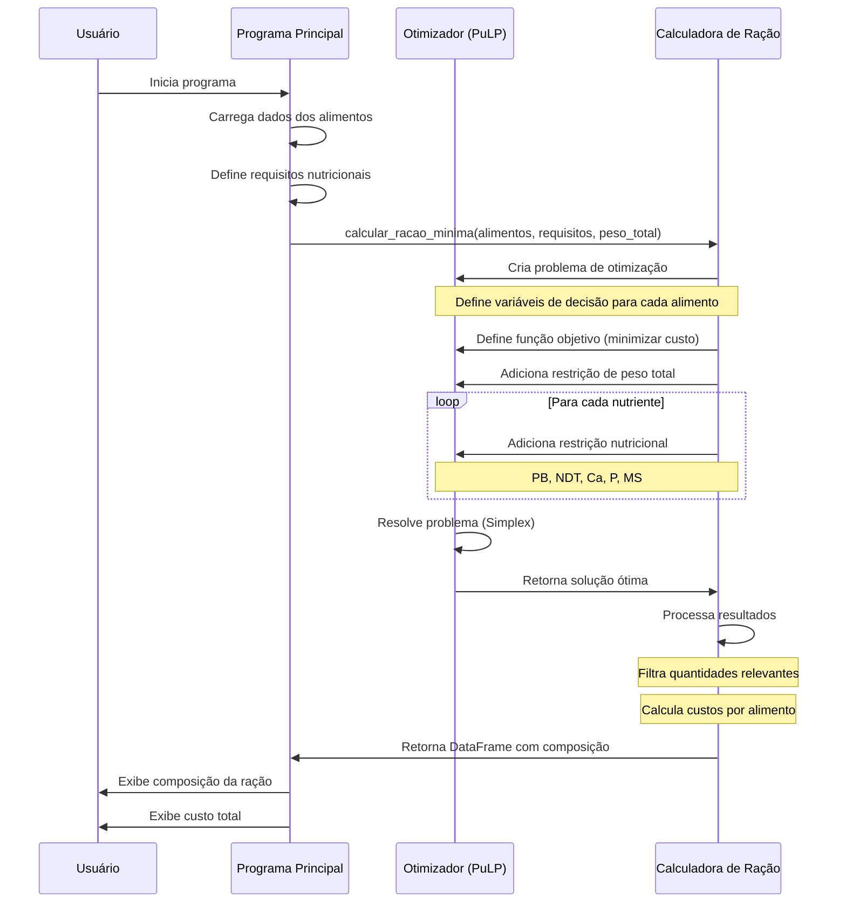

# Calculadora de Ração de Custo Mínimo

Sistema para cálculo de ração animal com custo mínimo utilizando programação linear (método Simplex). O programa foi desenvolvido especialmente para calcular rações para gado leiteiro, otimizando a composição dos ingredientes para atingir os requisitos nutricionais necessários com o menor custo possível.

## Características

- Otimização de custos usando programação linear
- Cálculo baseado em requisitos nutricionais do NRC
- Suporte para múltiplos ingredientes
- Controle de restrições nutricionais
- Relatório detalhado de composição e custos

## Requisitos Nutricionais Considerados

- Matéria Seca (MS)
- Proteína Bruta (PB)
- Nutrientes Digestíveis Totais (NDT)
- Cálcio (Ca)
- Fósforo (P)

## Ingredientes Suportados

- Silagem de Milho
- Feno de Tifton
- Farelo de Soja
- Milho Moído
- Caroço de Algodão
- Suplementos Minerais

## Diagrama de Sequência


## Instalação

1. Clone o repositório:
```bash
git clone https://seu-repositorio/racao-custo-minimo.git
cd racao-custo-minimo
```

2. Crie um ambiente virtual Python:
```bash
# Windows
python -m venv venv
venv\Scripts\activate

# Linux/MacOS
python -m venv venv
source venv/bin/activate
```

3. Instale as dependências:
```bash
pip install -r requirements.txt
```

## Como Usar

1. Ative o ambiente virtual:
```bash
# Windows
venv\Scripts\activate

# Linux/MacOS
source venv/bin/activate
```

2. Execute o programa:
```bash
python racao.py
```

3. O programa irá exibir:
   - Composição otimizada da ração
   - Quantidade de cada ingrediente
   - Custo por ingrediente
   - Custo total da ração

## Exemplo de Saída

```
Composição da Ração Diária para Vaca Leiteira:
           alimento  quantidade_kg  custo
0  Silagem de Milho           20.0   16.0

Custo Total da Ração Diária: R$ 16.00
```

## Personalização

### Ajustando Preços

Você pode atualizar os preços dos ingredientes no dicionário `dados_alimentos`:

```python
dados_alimentos = {
    'nome': ['Silagem de Milho', 'Feno de Tifton', ...],
    'preco': [0.80, 1.20, ...],  # Preços em R$/kg
    ...
}
```

### Modificando Requisitos Nutricionais

Ajuste os requisitos nutricionais no dicionário `requisitos`:

```python
requisitos = {
    'ms': 0.40,     # 40% de Matéria Seca
    'pB': 0.16,     # 16% de Proteína Bruta
    'ndt': 0.68,    # 68% de NDT
    'ca': 0.006,    # 0.6% de Cálcio
    'p': 0.004      # 0.4% de Fósforo
}
```

## Estrutura do Projeto

```
racao-custo-minimo/
│
├── racao_custo_minimo.py           # Programa principal
├── requirements.txt   # Dependências do projeto
├── README.md         # Este arquivo
└── venv/             # Ambiente virtual Python
```

## Dependências

- Python 3.8+
- PuLP - Para otimização linear
- Pandas - Para manipulação de dados
- NumPy - Para cálculos numéricos

## Limitações

- Os preços dos ingredientes são fixos e precisam ser atualizados manualmente
- Assume disponibilidade de todos os ingredientes listados
- Não considera variações sazonais nos nutrientes

## Contribuindo

1. Faça um Fork do projeto
2. Crie uma branch para sua feature (`git checkout -b feature/AmazingFeature`)
3. Commit suas mudanças (`git commit -m 'Add some AmazingFeature'`)
4. Push para a branch (`git push origin feature/AmazingFeature`)
5. Abra um Pull Request

## Autor

Norberto Hideaki Enomoto - [norberto.enomoto@gmail.com](mailto:norberto.enomoto@gmail.com)

## Licença

Este projeto está licenciado sob a Licença MIT - veja o arquivo [LICENSE.md](LICENSE.md) para detalhes.